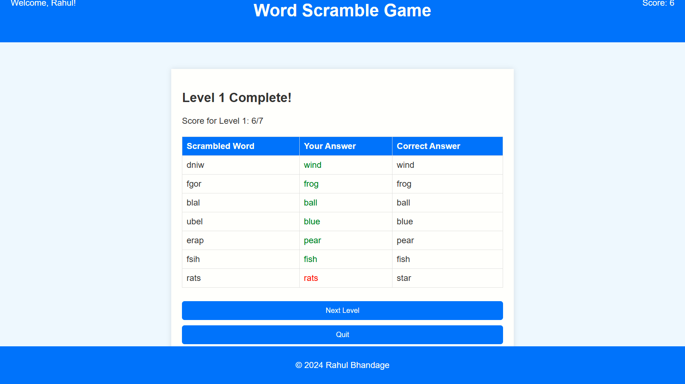

# Word Scramble Game Using Python Flask

Welcome to the Word Scramble Game! This is a web-based game built with Flask, where players unscramble words across three levels of increasing difficulty. The game tracks scores, provides feedback on answers, and displays results after each level.

## Features

- Three levels of difficulty with random word selection
- Real-time score tracking
- Immediate feedback on correct and incorrect answers
- Results displayed after each level with color-coded feedback
- Option to proceed to the next level or quit
- Professional UI with a blue theme

## Installation

Follow these steps to set up and run the project locally:

1. **Clone the repository**:

    ```bash
    git clone https://github.com/Rahul-Bhandage/Word-Scramble-Game-Using-Python-Flask.git
    cd Word-Scramble-Game-Using-Python-Flask
    ```

2. **Set up a virtual environment** (optional but recommended):

    ```bash
    python3 -m venv venv
    source venv/bin/activate  # On Windows, use `venv\Scripts\activate`
    ```

3. **Install dependencies**:

    ```bash
    pip install Flask
    ```

4. **Ensure you have a `words.csv` file** in the root directory with the following structure:

    ```csv
    Level 1,Level 2,Level 3
    word1,word2,word3
    word4,word5,word6
    ...
    ```

5. **Run the application**:

    ```bash
    python app.py
    ```

6. **Open your browser** and go to `http://127.0.0.1:5000` to play the game.

## Project Structure

- `app.py`: Main Flask application.
- `templates/`: HTML templates for the app.
  - `base.html`: Base template with header and footer.
  - `index.html`: Home page for username input.
  - `level.html`: Game page displaying scrambled words.
  - `level_complete.html`: Level completion page with results.
  - `game_over.html`: Final score display page.
- `static/`: Static files like CSS.
  - `style.css`: CSS for styling the app.
- `words.csv`: CSV file with words for each level.

## Screenshots

### Home Page


### Game Page


### Level Complete Page


### Game Over Page


## Author

- **Rahul Bhandage** - [GitHub](https://github.com/Rahul-Bhandage) - [LinkedIn](https://www.linkedin.com/in/rahulbhandage)

## Interests

- Mobile application development is my primary interest. I enjoy creating intuitive and efficient mobile apps that provide great user experiences.


